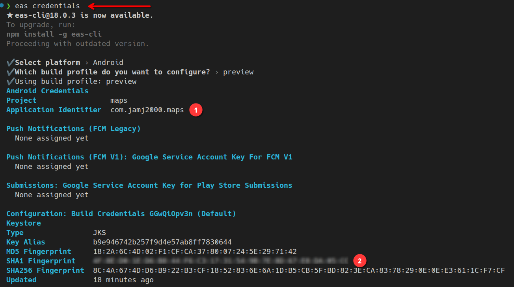
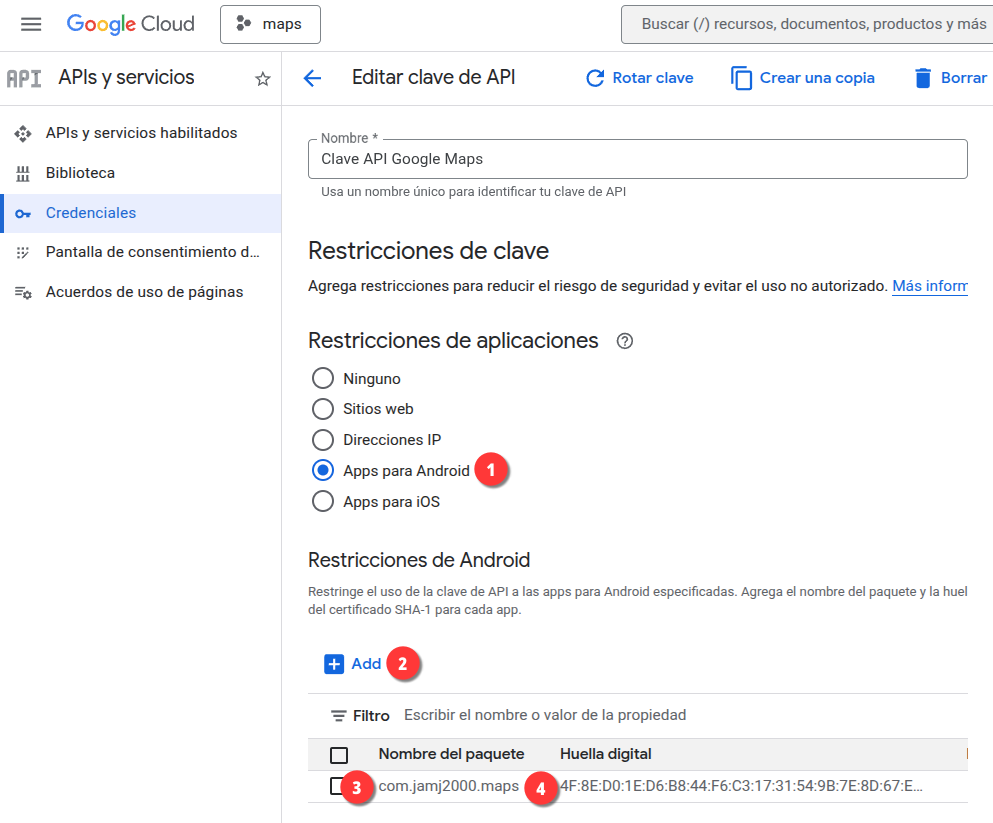

# Maps App

**Aplicación de React Native con Expo Router para trabajar con Mapas de Google**

## Recrear el proyecto

```bash
npx create-expo-app maps
npm install  zustand  expo-location react-native-maps@1.20.1
```

## Credenciales

### Google Cloud Console

1. Habilitar `Maps SDK for Android` en [https://console.cloud.google.com/apis/library](https://console.cloud.google.com/apis/library)

2. Crear credenciales / Clave de API en [https://console.cloud.google.com/apis/credentials](https://console.cloud.google.com/apis/credentials)

3. Editamos archivo `.env` y agregamos la clave de API

```bash
GOOGLE_MAPS_API_KEY=your_google_maps_api_key
```

4. Generamos credenciales

```bash
eas credentials
```



5. Establecemos restricciones de uso de la clave de API



6. Creamos la variable de entorno para EAS

```bash
eas env:create --name GOOGLE_MAPS_API_KEY --scope project
```


> [!NOTE]
> - Tipo: **String** 
> - Visibilidad: **Secret** 
> - Environment: **preview** 

```bash
eas env:list
```


7. Construimos la app
```bash
eas build --platform android --profile preview
```   